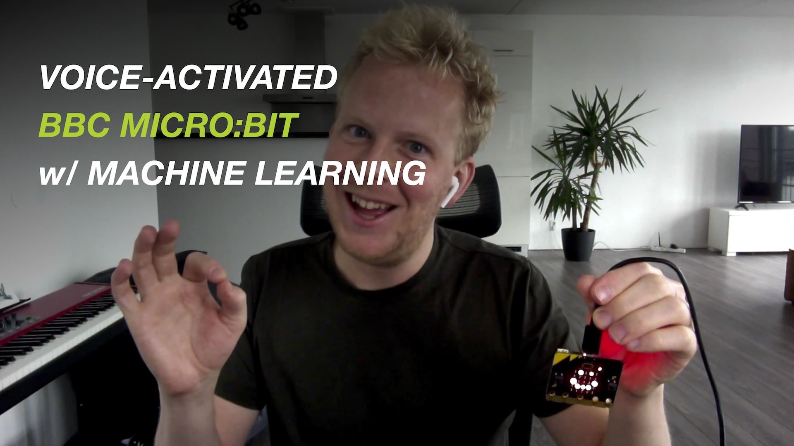

# Voice activated micro:bit

A demo application that makes your micro:bit 2 respond to your voice, built with Edge Impulse. This demo uses Machine Learning to analyze the audio feed coming from the microphone, then showing a smiley on screen when it hears "microbit".

Video tutorial:

[](https://www.youtube.com/watch?v=fNSKWdIxh8o&feature=youtu.be)

## How to build

1. Install [CMake](https://cmake.org), [Python 2.7](https://www.python.org) and the [GNU ARM Embedded Toolchain](https://developer.arm.com/tools-and-software/open-source-software/developer-tools/gnu-toolchain/gnu-rm). Make sure `arm-none-eabi-gcc` is in your PATH.
1. Clone this repository:

    ```
    $ git clone https://github.com/edgeimpulse/voice-activated-microbit
    ```

1. Build the project:

    ```
    $ python build.py
    ```

1. And flash the binary to your micro:bit, by dragging `MICROBIT.hex` onto the `MICROBIT` disk drive.

## How to change the keyword

You can build new models using [Edge Impulse](https://docs.edgeimpulse.com/docs).

1. [Sign up for an account](https://studio.edgeimpulse.com) and open your project.
1. Download the [base dataset](https://cdn.edgeimpulse.com/datasets/microbit-keywords-11khz.zip) - this contains both 'noise' and 'unknown' data that you can use.
1. Go to **Data acquisition**, and click the 'Upload' icon.
1. Choose all the WAV items in the dataset and leave all other settings as-is.
1. Go to **Devices** and add your mobile phone.
1. Go back to **Data acquisition** and now record your new keyword many times using your phone at frequency 11000Hz.
1. After uploading click the three dots, select *Split sample* and click *Split* to slice your data in 1 second chunks.
1. Follow [these steps](https://docs.edgeimpulse.com/docs/audio-classification#4-design-an-impulse) to train your model.

    > Note: use window length 999 instead of 1000!

Once you've trained a model go to **Deployment**, and select **C++ Library**. Then:

1. Remove `source/edge-impulse-sdk`, `source/model-parameters` and `source/tflite-model`.
1. Drag the content of the ZIP file into the `source` folder.
1. If you've picked a different keyword, change this in [source/MicrophoneInferenceTest.cpp](source/MicrophoneInferenceTest.cpp).
1. Rebuild your application.
1. Your micro:bit now responds to your own keyword 🚀.
